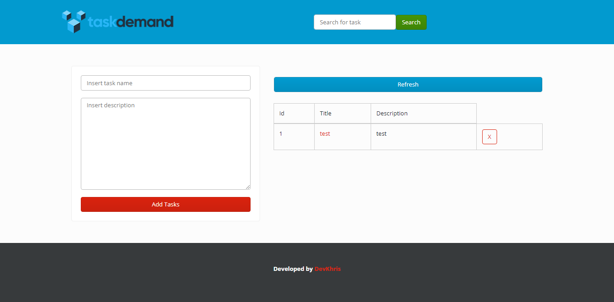

# TaskDemand WebAPP & API

## About

TaskDemand is a BREAD (Browser, Read, Edit, Add, Update) Task Management System with built-in basic routing and API services made on PHP using the Controller-View pattern and adapted to work in any hosting, includes Bootstrap, AJAX and Jquery for Frontend.

---
## Table of Contents
[TOC]

## Demo

__Data from db will be wipe after 24hrs to avoid abuse__

[Demo](https://taskdemand.000webhostapp.com/)

## API

### Endpoint for getting all tasks **^POST^**

```
> /tasks
```

### Endpoint for getting tasks by id  **^GET^**
Send the task id as part of the URI reemplacing the :id placeholder
to fetch task by id

```
> /tasks/:id
> example: https://taskdemand.000webhostapp.com/tasks/1
```

### Endpoint for search tasks by title **^POST^**
Send the query as part of the URI reemplacing the :query placeholder
to fetch search results

```
- > /tasks/search/:query
- > example: https://taskdemand.000webhostapp.com/tasks/search/querytext
```

### Endpoint for adding tasks **^POST^**
Add tasks sending data with keys 'title', 'description', id will be auto-generated

```
> /task/add
```

### Endpoint for editing tasks **^POST^**
Edit tasks sending data with keys 'id', 'title', 'description', id should be the specific tasks id

```
> /task/edit

```

### Endpoint for deleting task **^POST^**
Delete task sending the id of task as part of the URI reemplacing the :id placeholder

```
> /task/delete/:id
> example: https://taskdemand.000webhostapp.com/task/delete/1
```

## Coming Next
> Ideas for v2
- User Backend
- Auth and Session handling
- Individual tasks per user
- Middleware and Security improvements
- Soft-deleting for tasks
- Tasks completion and expiration date

This project is licensed under the [MIT License](LICENSE), want to contribute? do a barrel roll! (PR)
